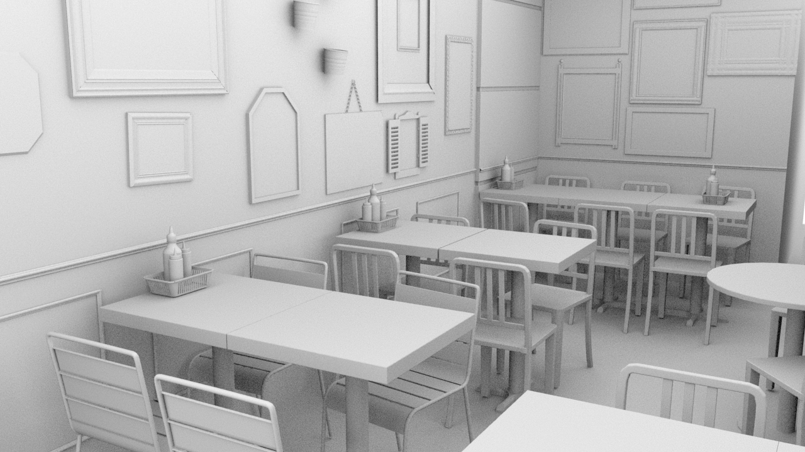
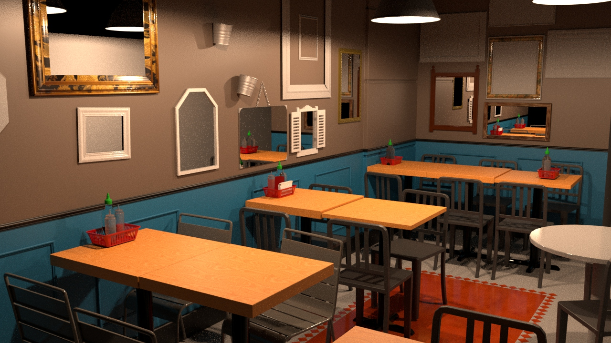

# tuktuk-render
This repository contains the processes used to achieve a photorealistic redering of a restaurant interior in Bristol City Center.

It contains Maya files used to develop this, a document describing the process and the final rendered image.
## Ambient Occlusion Render

## Final Textured Render

